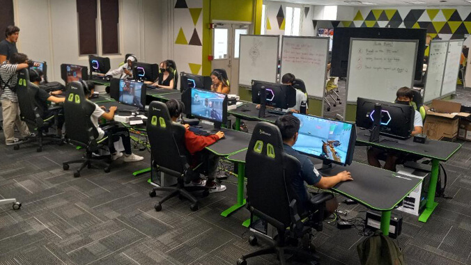

I will soon be working onboard the UHE (UH E-Sports) website development team. As a member of UH E-Sports myself, and a player on the Apex Legends Varsity team, it is a privilege to be able to apply and hone my web development skills for a school program that I'm passionate about.

The website will be a hub for members of the organization in addition to being a warm welcome for anyone interested in the E-Sports program at UH Manoa.

It will begin development when the graphics and website layout have been approved by the administration. I will work with a team of 6 people that may increase according to the work load. My job will be to create the webpages as requested by the administrators and graphic design team of UHE.

I hope to come out of this project with a heightened knowledge of Web Development.

The lead of the development team can be contacted at: briandd@hawaii.edu
