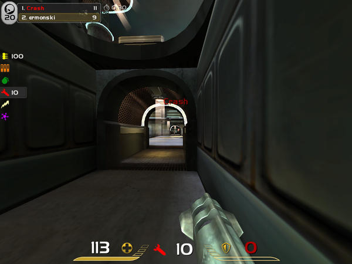

I am working on a small FPS game that is to be developed in Roblox Studio. The game will take visual inspiration from late 90s and early 2000s first person shooter games, such as Quake as shown above.

The game will be unique in that its gameplay is pvp based, but there will only be two players in any given match. It will be heavily strategic and self-focused
due to this design choice, an aspect that has been lost in modern shooter titles which typically are comprised by large team sizes (Think Call of Duty or any Battle-Royale-type game).


 
Source: <a href="https://github.com/theVacay/vacay">theVacay/vacay</a>
