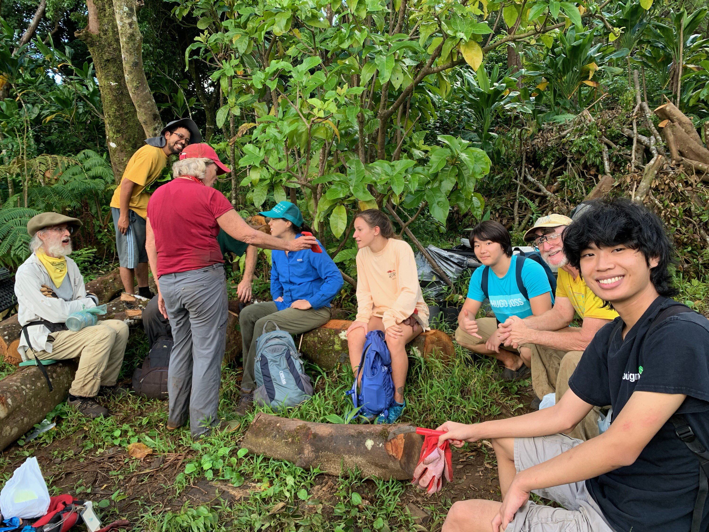

In 2019 I volunteered to help in the conservation of the forest atop Tantalus Mountain as a part of my Travel Industry Management program requirements.

It was a deeply humbling experience to be so exposed to the environment in a way on a scale I had never felt before. Surrounding me was several miles of just forest and lush greenery, and the goal was to protect it all.

I was tasked with uprooting invasive plants and clearing out area so that the rest of my group which consisted of around 10 people could traverse. It was physically demanding and the most exhausting volunteer work I had ever done.

But it was deeply rewarding to know that I was even a small part of an effort so large. I learned from it a greater appreciation of our island.
